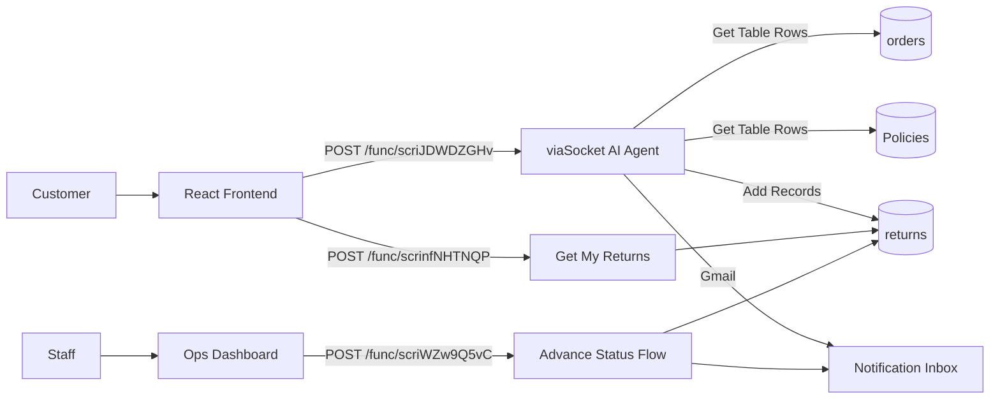

# IKIGAI Judging Brief — ReturnPilot

**Track:** AI Frontiers and Smart Systems
**Problem:** Resolve a customer's return request from a vague natural-language message, check policy eligibility, create or decline the return, and notify at each lifecycle stage — with genuine multi-step agent reasoning, not a scripted chatbot.
**Repository assessment:** A real, fully-wired React frontend exists and works against a live backend, but the backend itself (the actual AI agent, its prompt, and its tool configuration) lives entirely inside viaSocket's no-code UI, not as runnable code in this repository — `VIASOCKET_ARCHITECTURE.md` documents it faithfully, but a judge with GitHub-only access cannot independently execute or diff it the way they could a code-based agent.

## What They Built

- A React customer app (`frontend/src/`) — login, chat with a live reasoning-trace panel, a "My Returns" list backed by a real fetch (not mock data), and a 4-stage return tracker.
- A separate standalone ops/company dashboard (`frontend/public/ops-dashboard.html`), deliberately kept out of the main app, for staff to advance a return's status and trigger notifications.
- A viaSocket-native AI Agent (documented, not in-repo) with three tools — order lookup, policy lookup, and return-record creation — gated behind agent-decided tool use, not a hardcoded pipeline.
- An abandoned FastAPI/Postgres backend (`backend/`) kept as a documented fallback from an earlier architecture decision, not the live system.
- A declined-return path: ineligible requests now create an auditable record instead of vanishing silently.

## Architecture

## Core Capability Check

| Capability | Status | Evidence |
|---|---|---|
| Vague-language order resolution | 🟡 Partial | Behavior documented + verification history in `VIASOCKET_ARCHITECTURE.md`; not independently re-runnable from repo code alone |
| Eligibility check (window/final-sale) | 🟡 Partial | Same doc records a real observed failure mode (policy lookup returning "unavailable" causing a wrong approval) and its mitigation — an honest, not glossed-over, entry |
| Return creation with audit trail | ✅ Verified | `frontend/src/api.js` `getMyReturns()` shows real dedup/filter logic built specifically around observed data (duplicate writes, non-numeric legacy IDs) — code that only exists because real bugs were hit and handled |
| Frontend ↔ backend wiring | ✅ Verified | `frontend/src/api.js`, `ChatView.jsx`, `MyReturns.jsx` call real external endpoints directly, no mock layer |
| Declined-request tracking + visibility split | ✅ Verified | `api.js` filters `status === 'declined'` from customer view; `public/ops-dashboard.html` shows it greyed out for staff |
| Ops dashboard, browser-verified | 🔴 Missing | Built and served correctly (HTTP 200), but no click-through/UI test exists in the repo or its history |
| MCP server exposure | 🔴 Missing | Not attempted; everything is plain webhook HTTP, not MCP |

## Technical Read

**Strongest technical aspect:** The frontend's defensive data handling is genuinely earned, not generic — `getMyReturns()` specifically guards against a non-array "no data found" response shape, filters legacy non-numeric IDs, and dedupes duplicate writes by keeping the latest row per `order_id`. Each of these exists because a real bug was hit and diagnosed, which is visible in the code's comments.

**Biggest technical concern:** The core "agentic reasoning" — the actual judged requirement for this track — is not inspectable as code anywhere in the repository. It's a prompt and tool configuration living inside a third-party no-code platform. If the platform, the specific flow, or the account access is unavailable at judging time, there is no fallback demonstration path; the abandoned FastAPI backend has no business logic implemented (only Task 1–4 of 18).

**Core workflow:** Partial — the eligible and declined paths are both documented as independently working, but a repository-only reviewer cannot confirm this without either a live demo or trusting the written record.
**Implementation confidence:** Medium — high confidence the system works as documented, low confidence a judge can verify that from the repo alone.

## Judge Metrics

| Metric | Assessment |
|---|---|
| Technical Ambition | 4/5 |
| Architecture | 3/5 |
| Engineering | 3/5 |
| Demo Risk | High |

## IKIGAI Score

| Criterion | Score |
|---|---|
| Innovation & Creativity | 18/25 |
| Technical Implementation | 18/30 |
| Problem Solving | 15/20 |
| UI/UX & Presentation | 7/10 |
| Impact & Scalability | 8/15 |
| **Total** | **66/100** |

*Technical Implementation and Impact & Scalability are the categories most held back by repo-verifiability: the agent logic isn't runnable code, there's no unfiltered "all returns" query (the ops dashboard hardcodes 3 customer names), and notifications go to one fixed test inbox rather than real customers — a real scalability ceiling, not a cosmetic one.*

## Ask the Team

1. `api.js`'s `getMyReturns()` treats `{"message": "No data found..."}` as a special case rather than an empty array — what other response shapes from the platform have caused silent failures you haven't caught yet?
2. The Policies lookup has returned inconsistent window values (10 vs. 15 days for Electronics) across separate calls, and once failed entirely and caused a wrong approval before a safety-net instruction was added — what's the actual root cause, and how confident are you it won't recur live?
3. Every notification — initiated, shipped, refunded — goes to one hardcoded inbox, not the real customer. What's the path to real per-customer notification, and does that change your "Best Use of viaSocket" story?
4. The ops dashboard has never been tested in an actual browser session. Walk me through what happens if two staff members advance the same return at the same time — given status changes are inserts, not updates.
5. If viaSocket were unavailable right now, what portion of this system could you demonstrate at all?
